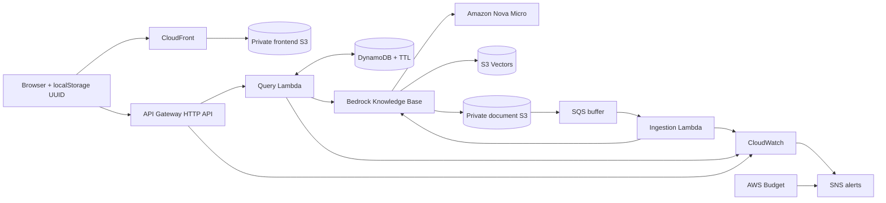

# Low-cost Amazon Bedrock RAG chatbot

A deliberately small browser chatbot that retrieves from a private Amazon Bedrock
Knowledge Base, answers with Amazon Nova Micro, displays sanitized citations, and
keeps anonymous browser-session history in DynamoDB. Terraform provisions the
infrastructure; GitHub Actions uses separate repository-scoped AWS OIDC roles and
promotes exact reviewed binary plans.

The design was documented before implementation. See the [planning index](docs/README.md).

> **Cost warning:** Bedrock inference and ingestion are usage-billed, promotional
> credits can expire, and vector storage can continue to cost money while deployed.
> AWS Budgets sends alerts but does not stop spending. Destroy this demonstration
> when it is no longer required.

## Architecture



There is no VPC, NAT Gateway, authentication system, WebSocket, streaming path, or
always-on compute.

## Behavior and flows

On first use, the frontend creates a UUID and stores it in browser local storage.
`POST /chat` validates the UUID and question, queries that DynamoDB partition,
formats at most 12 prior messages as conversational context, and calls Bedrock
`RetrieveAndGenerate`. The answer is returned only when retrieval citations exist;
otherwise the API gives a clear insufficient-information response. User and
assistant messages receive a configurable TTL.

`GET /sessions/{sessionId}/messages` restores unexpired history in chronological
order. Missing, unknown, or expired session IDs safely produce an empty list. “New
chat” creates a new UUID without deleting any other session.

S3 sends create/update/delete notifications only for
`knowledge-base/documents/` to SQS. A 60-second Lambda batch window coalesces bursts,
reserved concurrency is one, and the handler starts one incremental ingestion job.
If a job is active, the batch is retried. Repeated failures reach an encrypted DLQ
and raise an alarm. Ingestion is eventually consistent; the Lambda logs the job ID
but does not wait synchronously for indexing.

More detail: [architecture and flows](docs/architecture.md).

## Service and model choices

| Concern | Selection | Reason |
|---|---|---|
| Region | `us-east-1` | Current overlap for Nova Micro, Titan V2, Knowledge Bases, and S3 Vectors |
| Generation | `amazon.nova-micro-v1:0` | Lowest-cost preferred text-only Amazon model |
| Embeddings | `amazon.titan-embed-text-v2:0`, 256 float32 dimensions | Supported, Amazon-native, compact vectors |
| Vector store | S3 Vectors | Terraform-native and no continuously running cluster |
| API | API Gateway HTTP API | Simpler and lower cost than REST API |
| History | DynamoDB on-demand | Keyed queries, serverless capacity, native TTL |
| Frontend | private S3 + CloudFront OAC | No public bucket or S3 website endpoint |
| Encryption | AWS-managed service encryption | Avoids customer-managed KMS key monthly cost and policy overhead |

S3 Vectors is semantic-search only and has metadata limits, which are acceptable for
this small text corpus. OpenSearch Serverless/managed and Aurora pgvector were
rejected because their baseline operations/cost are disproportionate. Third-party
stores add credentials and another control plane.

Availability was checked on 2026-07-28 against:

- [Bedrock Knowledge Base supported models](https://docs.aws.amazon.com/bedrock/latest/userguide/knowledge-base-supported.html)
- [Nova Micro model card](https://docs.aws.amazon.com/bedrock/latest/userguide/model-card-amazon-nova-micro.html)
- [S3 Vectors Regions and quotas](https://docs.aws.amazon.com/AmazonS3/latest/userguide/s3-vectors-regions-quotas.html)
- [S3 Vectors with Bedrock Knowledge Bases](https://docs.aws.amazon.com/AmazonS3/latest/userguide/s3-vectors-bedrock-kb.html)
- [Terraform Knowledge Base resource](https://registry.terraform.io/providers/hashicorp/aws/latest/docs/resources/bedrockagent_knowledge_base)

Recheck before deploying in another Region. The generation/embedding model IDs and
embedding dimensions are variables. Use `generation_model_arn_override` when the
chosen ID requires an inference-profile ARN.

## Repository

```text
.github/workflows/application.yml tests and application security gates
.github/workflows/terraform.yml   script-free plan/apply/destroy orchestration
.github/actions/terraform-*       reusable Terraform command implementation
bootstrap/                        local-only Terraform state-bucket bootstrap
docs/                             pre-build architecture and implementation plans
documents/                        small original demo corpus
frontend/                         static HTML, CSS, JavaScript, and API template
lambdas/chat/                     ZIP-deployed HTTP API + RAG handler
lambdas/ingestion/                SQS-coalesced ingestion starter
scripts/                          post-deployment smoke test only
terraform/                        single understandable Terraform root module
tests/                            Python unit tests
```

## Security and IAM

Both S3 buckets block all public access, enforce TLS, use bucket-owner-enforced
ownership, and encrypt objects. The document bucket is versioned; noncurrent demo
versions expire after 30 days. CloudFront uses Origin Access Control and HTTPS with
security response headers. The frontend contains only the public API endpoint.

Each Lambda has a separate role. The query role can write its log group, query/write
one DynamoDB table, retrieve from one Knowledge Base, and invoke the selected model.
The ingestion role consumes one queue, writes one log group, and operates ingestion
for the selected Knowledge Base. The Bedrock role reads only the document prefix,
invokes only the embedding model, and operates only one vector index. See the
[IAM matrix](docs/iam-matrix.md).

AWS currently requires `Resource: "*"` for the exact
`bedrock:RetrieveAndGenerate` action because it does not support resource-level
authorization. This is the sole intentional resource wildcard; the action is not a
wildcard, the Knowledge Base ID is fixed in the Lambda environment, and model
invocation is scoped to the selected model ARN.

The API is intentionally unauthenticated and can be abused. Cost/misuse controls are
stage throttling, a 2,000-character input limit, bounded history/retrieval/output,
short log retention, alarms, an ingestion DLQ, and the mandatory budget. AWS WAF,
authentication, Bedrock Guardrails, per-client quotas, and centralized audit controls
are production enhancements, not part of this demo.

Trivy keeps high/critical Terraform findings blocking. Its time-bounded exceptions
cover only this documented no-WAF choice and the deliberate use of AWS-managed/SSE-S3
encryption to avoid customer-managed KMS key cost and policy overhead; review them
before their recorded expiry.

Citations show an object filename and a short excerpt. Raw private S3 URIs are
removed and presigned downloads are not generated.

## SSM configuration flow

Terraform manages two String parameters:

- `/<project>-<environment>/bedrock/generation-model-id`
- `/<project>-<environment>/bedrock/knowledge-base-id`

Terraform data sources resolve them during deployment and inject their values into
Lambda environment variables. The Lambda makes no SSM call on a chat request.

## Prerequisites

- An AWS account with permission to use Bedrock Knowledge Bases, S3 Vectors, Nova
  Micro, and Titan Text Embeddings V2 in the selected Region
- Amazon Bedrock model access/activation completed if the account requires it
- Terraform 1.15.8
- Permission to create or adopt the encrypted, versioned, private Terraform-state
  S3 bucket through the local `bootstrap/` Terraform root
- Separate AWS IAM plan and deployment roles trusted for GitHub Actions OIDC
- Python 3.13 plus `pip` for local unit tests
- AWS CLI credentials for local plans, or GitHub OIDC for workflows

The deployment principal also needs account-level permissions for AWS Budgets and
the listed IAM/resource types. Some AWS APIs expose non-resource-scoped control-plane
actions; constrain those in the deployment role with repository,
environment, account, and Region conditions where possible.

## Backend and variables

The application root intentionally does not create its own backend bucket. Create a
new bucket or adopt the existing one with the local-only
[bootstrap root](bootstrap/README.md), then copy and edit:

```bash
cp backend.hcl.example backend.hcl
cp terraform.tfvars.example terraform.tfvars
```

`backend.hcl` uses native S3 lockfiles (`use_lockfile = true`). The plan/deployment roles
needs object access to the state and `.tflock`; delete is needed only for the lock.
DynamoDB locking is deprecated but a commented legacy option is provided.

Do not put AWS credentials in either file. `backend.hcl` and `terraform.tfvars` are
gitignored.

## Local commands

```bash
python -m venv .venv
source .venv/bin/activate
python -m pip install -r requirements-dev.txt
pytest
ruff check .

terraform fmt -check -recursive
terraform -chdir=terraform init -backend-config=../backend.hcl
terraform -chdir=terraform validate
terraform -chdir=terraform plan -var-file=../terraform.tfvars
```

Review every plan, especially IAM and cost-bearing resources. A successful plan does
not activate Bedrock models or prove that asynchronous ingestion has completed.

## GitHub Actions configuration

There are exactly two top-level workflows:

- `application.yml` tests and analyzes the Python Lambda and static frontend source.
- `terraform.yml` orchestrates Terraform using local composite actions. It contains
  no inline `run` or `script` blocks.

Create these GitHub Repository or Environment **Variables**:

| Variable | Purpose |
|---|---|
| `AWS_PLAN_ROLE_ARN` | Read-oriented GitHub OIDC role for plan/refresh |
| `AWS_DEPLOY_ROLE_ARN` | GitHub OIDC role for main-branch apply/destroy |
| `AWS_REGION` | Deployment Region, normally `us-east-1` |
| `TERRAFORM_VERSION` | Exact CI version, currently `1.15.8` |
| `TF_BACKEND_BUCKET` | Existing state bucket |
| `TF_STATE_KEY` | State object key |
| `TFVARS_FILE` | Committed file, normally `terraform/demo.tfvars` |
| `SNYK_ORG` | Snyk organization slug used explicitly by CLI scans |
| `SONAR_ORGANIZATION` | SonarCloud organization key |
| `SONAR_PROJECT_KEY` | SonarCloud project key |

Create these GitHub **Secrets**:

| Secret | Purpose |
|---|---|
| `SNYK_TOKEN` | Snyk Open Source and Code analysis |
| `SONAR_TOKEN` | SonarCloud analysis and quality-gate polling |

AWS authentication uses OIDC and never uses stored AWS access keys. Workflows
reference secrets only through GitHub’s secret context, so token values are masked
and are not written to command arguments, artifacts, packages, or summaries.

Snyk and SonarCloud emit a notice and skip when their external configuration is
absent, while tests, Ruff, CodeQL, and available GitHub-native checks still run.

The repository includes a non-secret `terraform/demo.tfvars`. Select another
committed non-secret environment file with `TFVARS_FILE` when needed. This project
has no application secrets.

## Application security and deployment packages

Application CI performs these source-level checks:

- Ruff and pytest with coverage
- CodeQL SAST for Python and JavaScript
- Snyk Open Source SCA and Snyk Code SAST
- SonarCloud analysis and quality gate

Application CI runs on every pull request, manual dispatch, and push to `main`, so
all required branch-protection checks always report a result. SonarCloud analyzes
internal pull requests and `main`, avoiding redundant feature-branch push analysis.

There is no container registry path. Terraform creates ZIP archives from the Python
Lambda directories and deploys them directly to Lambda. It uploads the plain HTML,
CSS, JavaScript, and rendered `config.js` to the private frontend S3 bucket served
by CloudFront. CI therefore analyzes the same source that Terraform deploys instead
of maintaining a second deployment package format.

The two IAM role trust policies constrain:

- provider: `token.actions.githubusercontent.com`
- audience: `sts.amazonaws.com`
- subject to the exact `OWNER/REPOSITORY`
- immutable owner and repository IDs for repositories using GitHub's immutable OIDC
  subject format
- the exact protected `main` branch ref for apply/destroy
- intended branch/ref for plan operations
- no wildcard organization trust

Example condition fragment:

```json
{
  "StringEquals": {
    "token.actions.githubusercontent.com:aud": "sts.amazonaws.com"
  },
  "StringLike": {
    "token.actions.githubusercontent.com:sub": [
      "repo:OWNER@OWNER-ID/REPOSITORY@REPOSITORY-ID:pull_request",
      "repo:OWNER@OWNER-ID/REPOSITORY@REPOSITORY-ID:ref:refs/heads/feature/initial-bedrock-rag",
      "repo:OWNER@OWNER-ID/REPOSITORY@REPOSITORY-ID:ref:refs/heads/main"
    ]
  }
}
```

The plan role trusts pull requests from this repository plus explicitly approved
branch refs. Without GitHub Environments, the deployment role trusts only
`repo:OWNER@OWNER-ID/REPOSITORY@REPOSITORY-ID:ref:refs/heads/main`. GitHub
repositories created after 2026-07-15 use this immutable ID-bearing subject format
by default. Protect `main` with required pull-request reviews and passing checks;
apply/destroy additionally require an explicit reviewed-operation selection. The workflow
automatically selects the newest successful unexpired manual or `main`-push plan
artifact for the exact commit and requested mode.

## Plan, apply, and destroy

Pull requests from the same repository run plan only, upload the binary plan,
human-readable plan, dependency lockfile, and immutable metadata, and create/update
one PR comment containing only the final 120 plan lines; the complete readable plan
remains in the artifact. Terraform redacts declared sensitive values, and the
workflow never prints Terraform JSON outputs. Fork PRs are not given AWS/backend
access and cannot produce a promotable artifact.

Manual `plan` works through the same workflow. The artifact records commit SHA,
source run/event/repository/ref, Terraform and runner versions, working directory,
backend identity, tfvars identity, timestamp, lockfile checksum, and plan checksum.
Artifacts are retained for seven days.

In GitHub's manual-run form, **Use workflow from** is the built-in branch selector.
Choose `main` for either reviewed apply operation. The single **Terraform operation**
field selects change plan, reviewed apply, destruction plan, or reviewed destruction.

PR plan artifacts are reviewable but normally cannot be promoted after merge because
the merge commit SHA differs. A relevant merge to `main` automatically runs a new
plan on the final merge commit; that exact artifact is promotable. A manual `plan`
through `workflow_dispatch` remains available and can produce a newer promotable
artifact for the same commit. Apply never silently replans.

To apply:

1. Review the PR plan, merge, and review the automatic plan on the final merge commit.
2. Select `main` under **Use workflow from**.
3. Choose **Apply reviewed changes**; the matching plan is selected automatically.

The job downloads that run’s artifact and rejects a checksum, commit, version,
provider lock, path, backend, variable, age, repository, source-run, runner, or trust
mismatch. It applies the exact binary plan and never generates a replacement plan.
Terraform binary plans are not portable; all checks intentionally fail closed.

To destroy:

1. From `main`, choose **Plan destruction**.
2. Review the exact destroy-plan artifact.
3. From the same `main` commit, choose **Apply reviewed destruction**; the matching
   destroy plan is selected automatically.

If an artifact expires or its commit is no longer the deployment target, generate
and review a new plan. Never promote an artifact from a fork.

## Deployment and operation

After apply, read:

```bash
terraform -chdir=terraform output
```

The outputs include the API URL, CloudFront domain, Knowledge Base/data source IDs,
both buckets, table, models, SNS topic, and budget name. If `alert_email` is set,
confirm the subscription email; unconfirmed subscriptions receive no alarms.

Repository documents are uploaded by Terraform. Add or update a file under
`documents/`, then review/apply a plan. Terraform writes it only under the knowledge
base prefix; the resulting S3 event schedules ingestion. Deletion also triggers an
incremental sync. Objects outside that prefix do not trigger ingestion.

The fixed-size chunker uses 500 tokens with 15% overlap: large enough to retain a
short technical explanation and small enough for precise retrieval, without the S3
Vectors metadata overhead of hierarchical chunking.

## Monitoring and budget

Terraform creates:

- Query Lambda error percentage (metric math)
- Ingestion Lambda errors
- Visible messages in the ingestion DLQ
- API Gateway HTTP API 5xx count
- DynamoDB throttled requests
- One encrypted SNS alert topic
- Mandatory monthly cost budget, 80% actual and 100% forecast notifications

The budget amount and alarm thresholds are variables. A budget is advisory; it
never disables the API or destroys resources.

## Tests and smoke checks

Unit tests cover request validation, invalid/unknown session IDs, TTL calculation,
DynamoDB response transformation, citation sanitization, empty retrieval behavior,
active ingestion retries, and burst coalescing.

After deployment:

```bash
export FRONTEND_URL="https://CLOUDFRONT_DOMAIN"
export API_URL="https://API_ID.execute-api.us-east-1.amazonaws.com"
bash scripts/smoke-test.sh
```

For ingestion, update a document, apply it, then inspect the ingestion Lambda logs
for `ingestion_started` and confirm the Bedrock job reaches `COMPLETE`. Ask a
question that depends on the updated text. Also verify all Terraform outputs.

## Cost drivers

Primary drivers are Nova input/output tokens, embedding ingestion, and S3 Vectors
storage/query operations. Secondary usage-based charges can come from API Gateway,
Lambda, DynamoDB, S3, CloudFront, logs, SNS, and alarms. Defaults use 256-dimensional
vectors, a tiny corpus, DynamoDB on-demand, 7-day logs, modest Lambda sizing,
CloudFront Price Class 100, no provisioned throughput, and no NAT Gateway.

Free Tier eligibility varies and does not imply Bedrock or vector operations are
free. Check current AWS pricing and the Billing console before deployment.

## Troubleshooting

- **Knowledge Base creation fails:** confirm the provider is 6.55.x, S3 Vectors is
  available, model access is active, and the Region/model/dimension combination is
  valid.
- **No citations:** wait for ingestion completion; inspect the data source job and
  document prefix. The application intentionally refuses uncited answers.
- **Ingestion DLQ alarm:** inspect structured Lambda logs and the latest Bedrock
  ingestion job. Redrive only after correcting permissions/quota/service errors.
- **CORS failure:** use the CloudFront domain rather than opening files locally and
  verify the deployed API CORS origin.
- **Empty history shortly after TTL:** records expire individually and DynamoDB TTL
  removal is asynchronous; application reads hide logically expired records.
- **Budget email absent:** confirm the SNS subscription.
- **Apply rejects artifact:** run apply from the planned commit and matching
  environment before the seven-day retention expires.
- **Destroy cannot empty buckets:** set `force_destroy_buckets=true` in a reviewed
  plan first, or remove retained object versions through an explicitly approved
  cleanup process.

## Known limitations and production hardening

The public session UUID is not identity or authorization. History writes are not
transactional as a pair, TTL does not extend old messages, ingestion completion is
not polled by the starter Lambda, CloudFront uses its default certificate/domain,
whose minimum TLS policy is controlled by CloudFront, there is no WAF or custom
domain, and semantic retrieval quality is evaluated only with a small corpus.

Production options include authentication/authorization, WAF/rate keys, Bedrock
Guardrails, transactional turn records, dedicated deployment roles, customer-managed
KMS keys, CloudTrail/data-event review, canary tests, ingestion-status polling,
custom domains, accessibility testing, restore policies, and formal RAG evaluation.

## Cleanup

Use the protected reviewed destroy workflow. Confirm Terraform outputs/resources are
gone, inspect the bootstrap-managed state bucket according to its retention policy, and
check S3 versions/S3 Vectors if destruction was blocked. The backend bucket and
bootstrapped GitHub OIDC roles are intentionally not destroyed by this repository.
