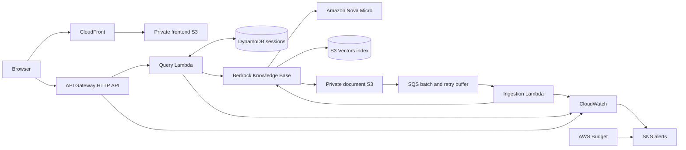

# Architecture and flows

## Selected architecture

No VPC or NAT Gateway is required. The public surfaces are CloudFront and the
unauthenticated HTTP API only.

## Chat request flow

1. JavaScript creates a UUID in local storage if no valid session ID exists and
   registers it in a browser-local conversation index.
2. `POST /chat` sends `sessionId` and `message`.
3. The Lambda validates UUID shape and input size, then queries one DynamoDB
   partition in ascending order with a bounded item limit.
4. It formats a bounded history plus the new question for `RetrieveAndGenerate`.
5. Bedrock retrieves S3 Vectors chunks and invokes Nova Micro with a grounding
   prompt that requires an explicit insufficient-information answer.
6. The Lambda transforms Bedrock citations into document names and short excerpts.
   Raw private S3 URIs are not returned as clickable URLs.
7. The user and assistant records are written with the same calculated expiry.
8. The API returns structured JSON.

## History flow

`GET /sessions/{sessionId}/messages` validates the ID and queries the same partition.
Unknown or expired sessions return an empty message list, not an error. DynamoDB TTL
deletion is asynchronous, so reads also exclude records whose `expires_at` is in the
past. New Chat creates and activates a new browser UUID; selecting a prior indexed
session restores that partition, and no action deletes another partition. The first
user question supplies the local display title. History is presented as a persistent
desktop sidebar and becomes an off-canvas drawer on narrow screens.

Table design:

- Partition key: `session_id` (string UUID)
- Sort key: `message_id` (`<UTC epoch milliseconds>#<uuid>`)
- Fields: `role`, `content`, `citations`, `created_at`, `expires_at`

Each turn uses a fresh, consistent expiry calculation. Existing older messages are
not rewritten; the session naturally retains messages until their individual TTLs
expire.

## Ingestion flow

1. S3 sends object-created and object-removed notifications only for
   `knowledge-base/documents/` to a standard SQS queue.
2. SQS coalesces bursts with a batch window. The Lambda event source has reserved
   concurrency one.
3. One Lambda invocation treats any non-empty batch as a request to synchronize the
   entire data source incrementally.
4. The handler checks recent ingestion jobs. If one is starting or running, it
   returns partial batch failures so SQS retries after a visibility delay.
5. Otherwise it calls `StartIngestionJob` once, logs its job ID/status, and
   acknowledges the batch.
6. Repeated transient failure exhausts redrive attempts and moves the messages to
   the DLQ, which has an alarm. A later sync accounts for creates, updates, and
   deletes because S3 data-source sync is incremental.

The Lambda starts jobs but does not wait for indexing. Retrieval is eventually
consistent; timing depends on corpus and Bedrock service load.

## Deployment-time SSM flow

Terraform creates:

- `/PROJECT/ENVIRONMENT/bedrock/generation-model-id`
- `/PROJECT/ENVIRONMENT/bedrock/knowledge-base-id`

Terraform data sources read those managed values during plan/apply. The resolved
values become Lambda environment variables. The Lambda does not call SSM per
request.

## CI/CD trust boundary

PR plans are review artifacts, not deployment authority. A main-branch-only manual
apply job requires an explicit reviewed-apply operation selection, automatically
selects the newest successful eligible exact-commit plan artifact, verifies artifact provenance and
immutable metadata, then applies the included binary plan
on the same OS/architecture,
Terraform version, provider lockfile, working directory, backend identity, variable
file, and commit. Fork PR plans are never promotable.

Application validation uses a separate workflow and trust boundary. Pull requests
and pushes test and analyze the Python Lambda and static frontend source. Terraform,
not a container registry, packages the Lambdas as ZIP archives and uploads the
frontend files to private S3 for CloudFront delivery.
